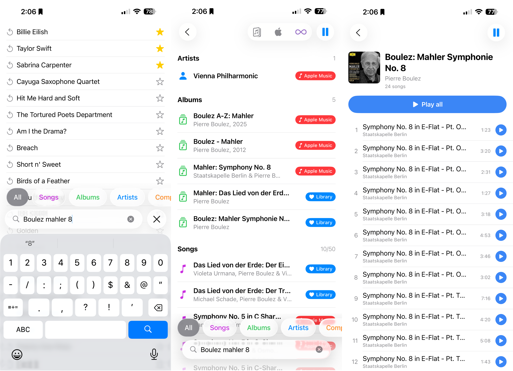

I have spent decades carefully curating my music library. It is one of my most treasured things. The library began as stacks of CDs—long gone now—but my habits never shifted to a world where music is rented for the short term. If you know me, you can guess the result: my library is… _diverse_. It includes some truly weird recordings you will never find on a streaming service.

As a classical musician and saxophonist, I keep _many_ recordings of the same piece. That runs against how popular music—and most streaming services—work. In pop, there is usually one definitive version of a song (plus the odd live cut). Add “Hey Jude” to your library and it will be there. You can even ask Siri to “play ‘Hey Jude,’” and she will probably get it right. Try asking, “Play Part II of Mahler’s Eighth Symphony conducted by Pierre Boulez,” and see what you get.

Type-to-search is not better. It takes six taps to reach library search in the Music app. When I search for “mahler,” the Boulez recording is not in **Top Results** or **Albums** (that’s seven taps), even though the album title is _Boulez: Mahler Symphonie No. 8_. I have to tap **Composers** (eight), then the album (nine), and finally the track I want (ten).

The end result is that I feel pushed away from my own library. Apple Music keeps steering me toward curated playlists and promotions. Those can be fine. They are not what I want when I already know the record I want to hear. The gap between thinking of a recording and hearing it became too wide.

Enter **Rush Music**.

In Rush Music, it takes three taps to get to the same result.

	
1. Open Rush Music and start typing. The search field is already focused, so there’s no delay.
2. Tap the album, song, artist, or composer you want.
3. Tap play.

Boom. Done.

Search is the center. Type a few letters and albums, artists, and songs appear together in one view. No hunting across tabs. If you want to drill into one artist’s catalog, tap a filter and go deep. If you see the track you wanted, tap and it plays.

This is not a replacement for the Music app or for Apple Music. It uses your existing subscription and your full library. It respects what you already built. It just moves faster.

I also removed anything that slows you down. There are no playlists. There are no queues. You can play albums from the beginning, as the artist intended. The Music app is only a tap away if you need it.

Rush Music is a lightweight front end to the Music app with a narrow focus on search. It is for people who love _their_ music. It improved my own listening by making it simpler. I hope it does the same for you.

_Built for iPhone. Works with your Apple Music subscription. If you try it, I would love to hear what you think._